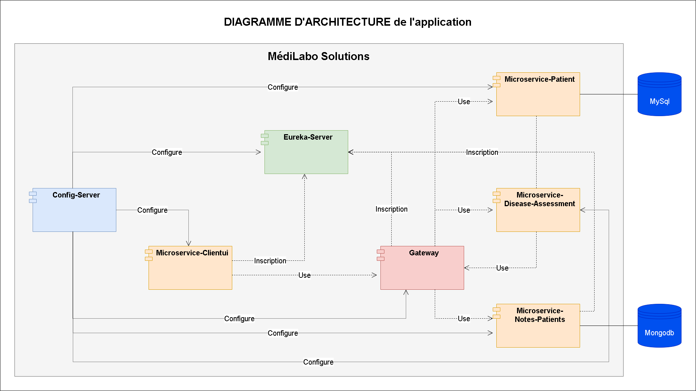

# MédiLabo Solutions

Il s'agit d'une **application DE TEST** de gestion de patients et de notes développée en Java avec Spring Boot 3.

Elle utilise:
* un serveur de configuration
* un serveur Eureka
* une gateway
* des microservices
* une base de données MySql
* une base de données MongoDB
* un conteneur Docker avec des images pour chaque élément et des volumes pour le contenu des bases de données

Cette application permet:
* d'afficher la liste des patients
* d'afficher le profil d'un patient
* de créer un nouveau patient
* de modifier le profil du patient
* de supprimer un patient
* d'ajouter des notes concernant le patient
* de modifier des notes concernant le patient
* de supprimer des notes concernant le patient
* de calculer le risque de diabète d'après le contenu des notes

## Pour commencer

Faire un fork du projet ou le cloner.

### Pré-requis

* Java___________: jdk 17.0.7
* Spring Boot____: 3.1.4
* Maven_________: 3.8.7
* JUnit___________: 5
* MySql__________: 8
* MongoDB______: 6
* Docker-desktop: 4.23

## PARTIE JAVA

### VARIABLES D'ENVIRONNEMENT

Elles sont utilisées par les fichiers '.properties' du projet et du dépôt pour les fichiers de configuration

Elles sont utilisées par le fichier 'docker-compose.yml'

La liste des variables d'environnement sont dans le 

### CREER un fichier JAR pour chaque élément du projet

_Executez la commande_ ``mvn clean package`` dans les dossiers:
* medilabo-config-server
* medilabo-eureka-server
* medilabo-gateway
* medilabo-microservice-patient
* medilabo-microservice-notes-patients
* medilabo-microservice-disease-assessment
* medilabo-clientui

### CREER un dépôt pour les fichiers de configuration

Ce dépôt contient les fichiers de configuration qui seront utilisés pour le démarrage de chaque service.

Exemple: 

Dans le fichier '.env' l'adresse du dépôt doit être mise après: 'MEDILABO_CONFIG_REPOSITORY='

### PREPARER la base de données MySql

**Créer une base de données medilabo**

### PREPARER la base de données MongoDB

**1-Créer un compte administrateur en utilisant une invite de commande**
* _Executez la commande_ ``mongosh``
* _Executez la commande_ ``use admin``
* _Executez la commande_ ``db.createUser({user:"admin", pwd:"adminpassword", roles:['userAdminAnyDatabase']})``

Vérifier l'ajout de l'utilisateur 'admin'
* _Executez la commande_ ``db.auth("admin","adminpassword")``
* Résultat: { ok: 1 }

Sortie
* _Executez la commande_ ``exit``

**2-Créer un compte utilisateur en utilisant une invite de commande**
* _Executez la commande_ ``mongosh localhost:27017/admin -u admin -p adminpassword``
* _Executez la commande_ ``use medilabo``
* _Executez la commande_ ``db.createUser({user:"user", pwd:"password", roles:[{db:"medilabo", role:"readWrite"}]})``

Vérifier l'ajout de l'utilisateur 'user'
* _Executez la commande_ ``db.auth("user","password")``  
* Résultat: { ok: 1 }

Sortie
* _Executez la commande_ ``exit``

### TESTER l'application EN LOCAL en ligne de commande

**1-Dans le dossier medilabo-config-server**
* _Executez la commande_ ``java -DCONFIG_SERVER=config-server -DCONFIG_SERVER_PORT=9101 -DMEDILABO_CONFIG_REPOSITORY="https://github.com/Philiform/medilabo-config-repo.git" -jar target/medilabo-config-server-0.0.1-SNAPSHOT.jar MedilaboConfigServerApplication.Class``

**2-Dans le dossier medilabo-eureka-server**
* _Executez la commande_ ``java -DCONFIG_SERVER=localhost -DCONFIG_SERVER_PORT=9101 -DEUREKA_SERVER=eureka-server -DEUREKA_SERVER_PORT=9102 -jar target/medilabo-eureka-server-0.0.1-SNAPSHOT.jar MedilaboEurekaServerApplication.Class``

**3-Dans le dossier medilabo-gateway**
* _Executez la commande_ ``java -DCONFIG_SERVER=localhost -DCONFIG_SERVER_PORT=9101 -DEUREKA_SERVER=localhost -DEUREKA_SERVER_PORT=9102 -DGATEWAY=gateway -DGATEWAY_PORT=9000 -jar target/medilabo-gateway-0.0.1-SNAPSHOT.jar MedilaboGatewayApplication.Class``

**4-Ouvrir la base de données MySql pour Medilabo**

**5-Dans le dossier medilabo-microservice-patient**
* _Executez la commande_ ``java -DCONFIG_SERVER=localhost -DCONFIG_SERVER_PORT=9101 -DEUREKA_SERVER=localhost -DEUREKA_SERVER_PORT=9102 -DJPA_SHOW_SQL=true -DMICROSERVICE_PATIENT=microservice-patient -DMICROSERVICE_PATIENT_PORT=9001 -DMYSQL_ROOT=root -DMYSQL_ROOT_PASSWORD=rootroot -DMYSQLDB=localhost -DMYSQLDB_DATABASE=medilabo -DMYSQLDB_PORT=3306 -jar target/medilabo-microservice-patient-0.0.1-SNAPSHOT.jar MedilaboPatientApplication.Class``

**6-Ouvrir la base de données MongoDB pour Medilabo**
* _Executez la commande_ ``mongod.exe -f CHEMIN_VERS_LE_FICHIER\mongod-medilabo.cfg``

**7-Dans le dossier medilabo-microservice-notes-patients**
* _Executez la commande_ ``java -DCONFIG_SERVER=localhost -DCONFIG_SERVER_PORT=9101 -DEUREKA_SERVER=localhost -DEUREKA_SERVER_PORT=9102 -DMICROSERVICE_NOTES_PATIENTS=microservice-notes-patients -DMICROSERVICE_NOTES_PATIENTS_PORT=9002 -DMONGODB=localhost -DMONGODB_DATABASE=medilabo -DMONGODB_PASSWORD=password -DMONGODB_PORT=27017 -DMONGODB_USER=user -jar target/medilabo-microservice-notes-patients-0.0.1-SNAPSHOT.jar MedilaboNotesPatientsApplication.Class``

**8-Dans le dossier medilabo-microservice-disease-assessment**
* _Executez la commande_ ``java -DCONFIG_SERVER=localhost -DCONFIG_SERVER_PORT=9101 -DEUREKA_SERVER=localhost -DEUREKA_SERVER_PORT=9102 -DMICROSERVICE_DISEASE_ASSESSMENT=microservice-disease-assessment -DMICROSERVICE_DISEASE_ASSESSMENT_PORT=9003 -jar target/medilabo-microservice-disease-assessment-0.0.1-SNAPSHOT.jar MedilaboDiseaseAssessmentApplication.Class``

**9-Dans le dossier medilabo-clientui**
* _Executez la commande_ ``java -DCONFIG_SERVER=localhost -DCONFIG_SERVER_PORT=9101 -DEUREKA_SERVER=localhost -DEUREKA_SERVER_PORT=9102 -DMICROSERVICE_CLIENTUI=microservice-clientui -DMICROSERVICE_CLIENTUI_PORT=8080 -jar target/medilabo-clientui-0.0.1-SNAPSHOT.jar MedilaboClientuiApplication.Class``

**10-Vérifier que tous les services communiquent avec le serveur Eureka**

Dans un navigateur internet:
* _coller l'adresse_ ``http://localhost:9102``

**11-tester l'application**

Dans un navigateur internet:  
* _coller l'adresse_ ``http://localhost:8080``  
* username: doctor1  
* password: 123456

### TESTER l'application EN LOCAL avec un IDE

**1-configurer l'exécution de config-server**

ajouter les variables d'environnement  
* CONFIG_SERVER=config-server
* CONFIG_SERVER_PORT=9101
* MEDILABO_CONFIG_REPOSITORY=https://github.com/Philiform/medilabo-config-repo.git

**2-configurer l'exécution d'eureka-server**

ajouter les variables d'environnement:
* CONFIG_SERVER=localhost
* CONFIG_SERVER_PORT=9101
* EUREKA_SERVER=eureka-server
* EUREKA_SERVER_PORT=9102

**3-configurer l'exécution de gateway**

ajouter les variables d'environnement:
* CONFIG_SERVER=localhost
* CONFIG_SERVER_PORT=9101
* EUREKA_SERVER=localhost
* EUREKA_SERVER_PORT=9102
* GATEWAY=gateway
* GATEWAY_PORT=9000

**4-configurer l'exécution du microservice-patient**

ajouter les variables d'environnement:
* CONFIG_SERVER=localhost
* CONFIG_SERVER_PORT=9101
* EUREKA_SERVER=localhost
* EUREKA_SERVER_PORT=9102
* JPA_SHOW_SQL=true
* MICROSERVICE_PATIENT=microservice-patient
* MICROSERVICE_PATIENT_PORT=9001
* MYSQL_ROOT=root
* MYSQL_ROOT_PASSWORD=rootroot
* MYSQLDB=localhost
* MYSQLDB_DATABASE=medilabo
* MYSQLDB_PORT=3306

**5-configurer l'exécution du microservice-notes-patients**

ajouter les variables d'environnement:
* CONFIG_SERVER=localhost
* CONFIG_SERVER_PORT=9101
* EUREKA_SERVER=localhost
* EUREKA_SERVER_PORT=9102
* MICROSERVICE_NOTES_PATIENTS=microservice-notes-patients
* MICROSERVICE_NOTES_PATIENTS_PORT=9002
* MONGODB=localhost
* MONGODB_DATABASE=medilabo
* MONGODB_PASSWORD=password
* MONGODB_PORT=27017
* MONGODB_USER=user

**6-configurer l'exécution du microservice-disease-assessment**

ajouter les variables d'environnement:  
* CONFIG_SERVER=localhost
* CONFIG_SERVER_PORT=9101
* EUREKA_SERVER=localhost
* EUREKA_SERVER_PORT=9102
* MICROSERVICE_DISEASE_ASSESSMENT=microservice-disease-assessment
* MICROSERVICE_DISEASE_ASSESSMENT_PORT=9003

**7-configurer l'exécution du microservice-clientui**

ajouter les variables d'environnement:  
* CONFIG_SERVER=localhost
* CONFIG_SERVER_PORT=9101
* EUREKA_SERVER=localhost
* EUREKA_SERVER_PORT=9102
* MICROSERVICE_CLIENTUI=microservice-clientui
* MICROSERVICE_CLIENTUI_PORT=8080

**8-Ouvrir la base de données MySql pour Medilabo**

**9-Ouvrir la base de données MongoDB pour Medilabo**
* _Executez la commande_ ``mongod.exe -f CHEMIN_VERS_LE_FICHIER\mongod-medilabo.cfg``  
* Exemple: 

**10-Démarrer les services dans l'ordre (attendre que chaque service soit démarré avant de démarrer le suivant)**
1 medilabo-config-server
2 medilabo-eureka-server
3 medilabo-gateway
4 medilabo-microservice-patient
5 medilabo-microservice-notes-patients
6 medilabo-microservice-disease-assessment
7 medilabo-clientui

**11-Vérifier que tous les services communiquent avec le serveur Eureka**

Dans un navigateur internet:
* _coller l'adresse_ ``http://localhost:9102``

**12-tester l'application**

Dans un navigateur internet:
* _coller l'adresse_ ``http://localhost:8080``  
* username: doctor1  
* password: 123456

## PARTIE DOCKER

### CREER un fichier JAR pour chaque élément du projet

_Executez la commande_ ``mvn clean package`` dans les dossiers:
* medilabo-config-server
* medilabo-eureka-server
* medilabo-gateway
* medilabo-microservice-patient
* medilabo-microservice-notes-patients
* medilabo-microservice-disease-assessment
* medilabo-clientui

### CREER les images pour chaque service
 
Ouvrir la ligne de commande dans le dossier racine (contient le fichier 'docker-compose.yml')
* _Executez la commande_ ``docker build -t medilabo-config-server ./medilabo-config-server``  
* _Executez la commande_ ``docker build -t medilabo-eureka-server ./medilabo-eureka-server``  
* _Executez la commande_ ``docker build -t medilabo-gateway ./medilabo-gateway``  
* _Executez la commande_ ``docker build -t medilabo-microservice-patient ./medilabo-microservice-patient``  
* _Executez la commande_ ``docker build -t medilabo-microservice-notes-patients ./medilabo-microservice-notes-patients``  
* _Executez la commande_ ``docker build -t medilabo-microservice-disease-assessment ./medilabo-microservice-disease-assessment``  
* _Executez la commande_ ``docker build -t medilabo-microservice-clientui ./medilabo-clientui``

### TESTER la validité du fichier 'docker-compose.yml'

Ouvrir la ligne de commande dans le dossier racine (contient le fichier 'docker-compose.yml')
* _Executez la commande_ ``docker-compose config``

### PHASE 1 - Démarrer les conteneurs

Ouvrir la ligne de commande dans le dossier racine (contient le fichier 'docker-compose.yml')  
_Executez la commande_ ``docker-compose up -d``

Résultat attendu:
* Container medilabo-config-server -> Healthy
* Container medilabo-eureka-server -> Healthy
* Container medilabo-gateway -> Healthy
* Container mongodb -> Healthy
* Container mysqldb -> Healthy
* Container medilabo-microservice-notes-patients -> Error
* Container medilabo-microservice-patient -> Error

Si le résultat obtenu ne correspond pas au résultat attendu:
* _Executez la commande_ ``docker-compose up -d``

### PHASE 2 - Configurer le conteneur 'medilabo-mongodb'

DANS DOCKER DESKTOP

**1-Créer un compte admin**

aller dans: CONTAINERS > mongodb > Exec (onglet)
* _Executez la commande_ ``mongosh``  
* _Executez la commande_ ``use admin``  
* _Executez la commande_ ``db.createUser({user:"admin", pwd:"adminpassword", roles:['userAdminAnyDatabase']})``  

Vérifier l'ajout de l'utilisateur 'admin'
* _Executez la commande_ ``db.auth("admin","adminpassword")``  
* Résultat: { ok: 1 }

Sortie
* _Executez la commande_ ``exit``

**2-Créer un compte utilisateur**

aller dans: CONTAINERS > mongodb > Exec (onglet)
* _Executez la commande_ ``mongosh localhost:27017/admin -u admin -p adminpassword``  
* _Executez la commande_ ``use medilabo``  
* _Executez la commande_ ``db.createUser({user:"user", pwd:"password", roles:[{db:"medilabo", role:"readWrite"}]})``

Vérifier l'ajout de l'utilisateur 'admin'
* _Executez la commande_ ``db.auth("user","password")``  
* Résultat: { ok: 1 }

Sortie
* _Executez la commande_ ``exit``

### PHASE 3 - Configurer le conteneur 'medilabo-mysqldb'

DANS DOCKER DESKTOP

**Créer une base de données MySql**

aller dans: CONTAINERS > mysql:8 > Exec (onglet)
* _Executez la commande_ ``mysql -u root -p``  
* Entrer le mot de passe: rootroot  
* _Executez la commande_ ``CREATE DATABASE medilabo;``  
* _Executez la commande_ ``exit``

### PHASE 4 - Démarrer les autres conteneurs

Ouvrir la ligne de commande dans le dossier racine (contient le fichier 'docker-compose.yml')
* _Executez la commande_ ``docker-compose up -d``

Résultat attendu:
* Container medilabo-config-server -> Healthy
* Container medilabo-eureka-server -> Healthy
* Container medilabo-gateway -> Healthy
* Container mongodb -> Healthy
* Container mysqldb -> Healthy
* Container medilabo-microservice-notes-patients -> Error
* Container medilabo-microservice-patient -> Error

Si le résultat obtenu ne correspond pas au résultat attendu:
* _Executez la commande_ ``docker-compose up -d``

### PHASE 5 - Vérifier que tous les services communiquent avec le serveur Eureka

Dans un navigateur internet:
* _coller l'adresse_ ``http://localhost:9102``

### PHASE 6 - tester l'application

Dans un navigateur internet:
* _coller l'adresse_ ``http://localhost:8080``  
* username: doctor1  
* password: 123456

## DOCUMENTATION des API REST

Dans un navigateur internet:
* Microservice-patient: _coller l'adresse_ ``http://localhost:9001/swagger-ui/index.html``
* Microservice-notes-patients: _coller l'adresse_ ``http://localhost:9002/swagger-ui/index.html``
* Microservice-disease-assessment: _coller l'adresse_ ``http://localhost:9003/swagger-ui/index.html``

## LANCER les tests unitaires pour chaque service

_Executez la commande_ ``mvn clean test``

## DIAGRAMME D'ARCHITECTURE

## GREEN CODE

Recommandations d’amélioration pour le projet (ID Eyrolles V3):
* 31 Valider les pages auprès du W3C
* 74 Ne jamais faire de SELECT * FROM
* 75 Limiter le nombre de résultats (clause LIMIT)

## Développé avec

eclipse 4.28.0

## Versions
**Dernière version SNAPSHOT :** 0.0.1

## Auteur

**Philippe PERNET** _alias_ [@Philiform](https://github.com/Philiform)

## License

Ce projet n'est pas sous licence
